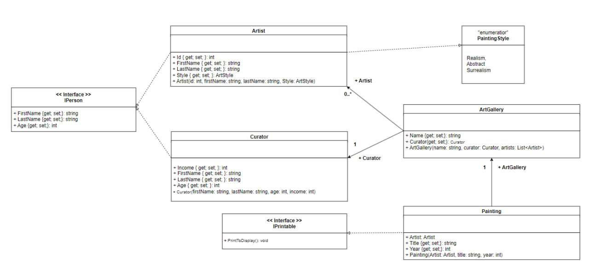

# Art Gallary

**Ідея проекту**: Збереження місця перебування картин та її даних в базі даних

Діаграма класу:

## Опис класів

- ArtGallery - заносимо назву галереї де зберігається картина та її назву (визначаємо хранителя).
- Artist - заносимо дані про id, ім'я та вік художника.
- Curator - ім'я, вік та зарплятня хранителя картини.
- Painting - встановлюємо назву, рік написання картини.

## Опис методів

- PrintToDisplay - повертає рядок який потім виводиться через Console.WriteLine()
