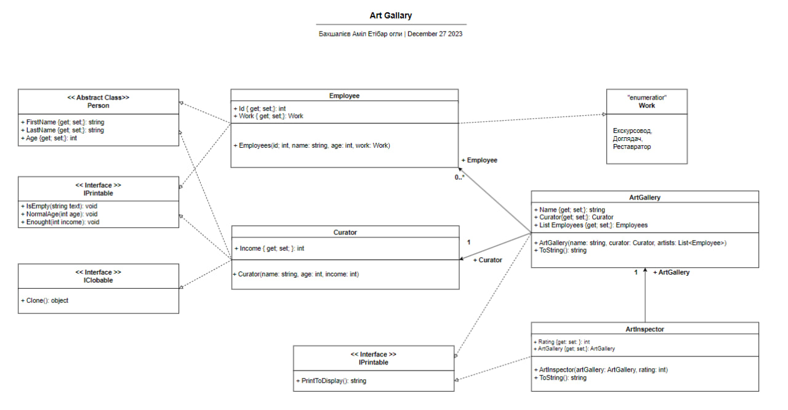

# Art Gallary

**Ідея проекту**: Заповнення база даних Галерей та інформацїї про них, оцінення їх по рейтенгу для зручності користувачів

Діаграма класу:

## Опис класів

- ArtGallery - заносимо назву галереї визначаємо хранителя та працівнеків.
- Employee - заносимо дані про id, ім'я, заробытню плату та вік робытникыв.
- Curator - ім'я, вік та зарплятня хранителя картини.
- ArtInspector - ставимо оцінку вибраній Гаререї.

## Опис методів

- PrintToDisplay - повертає рядок який потім виводиться через Console.WriteLine()
